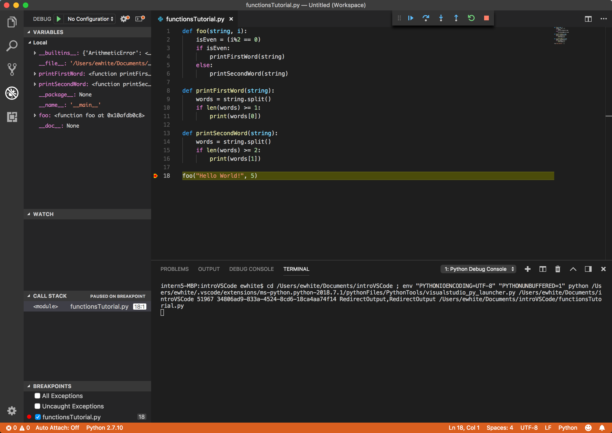
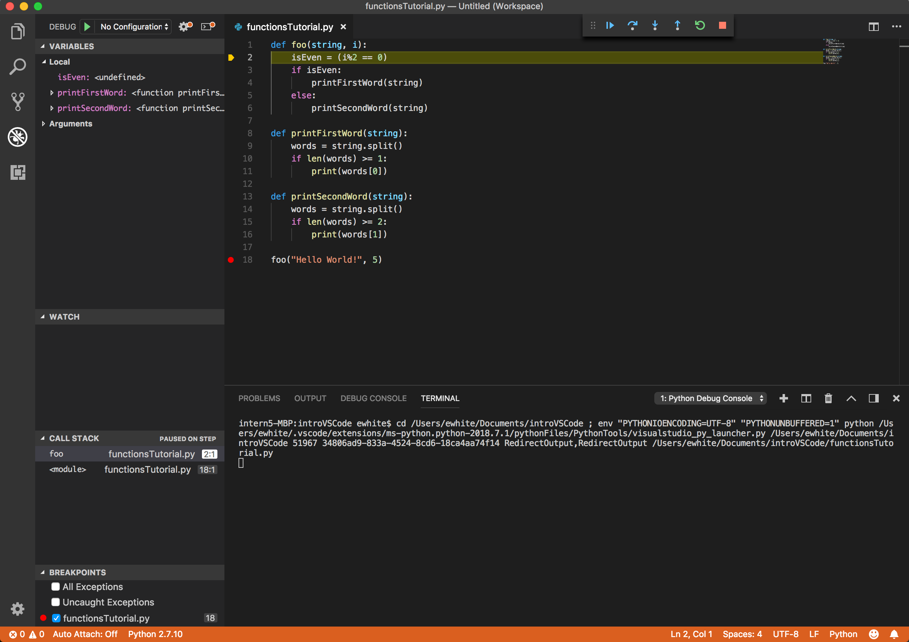
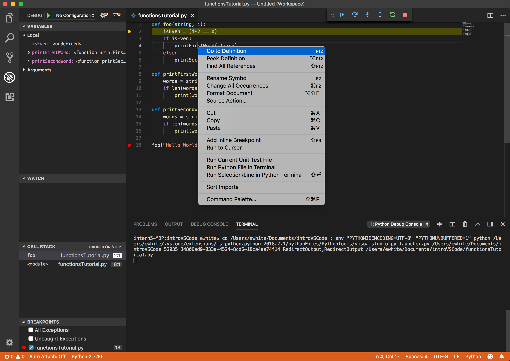
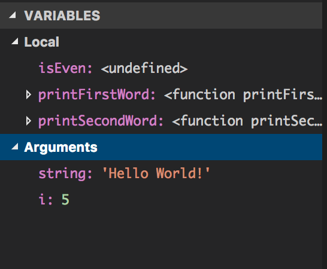
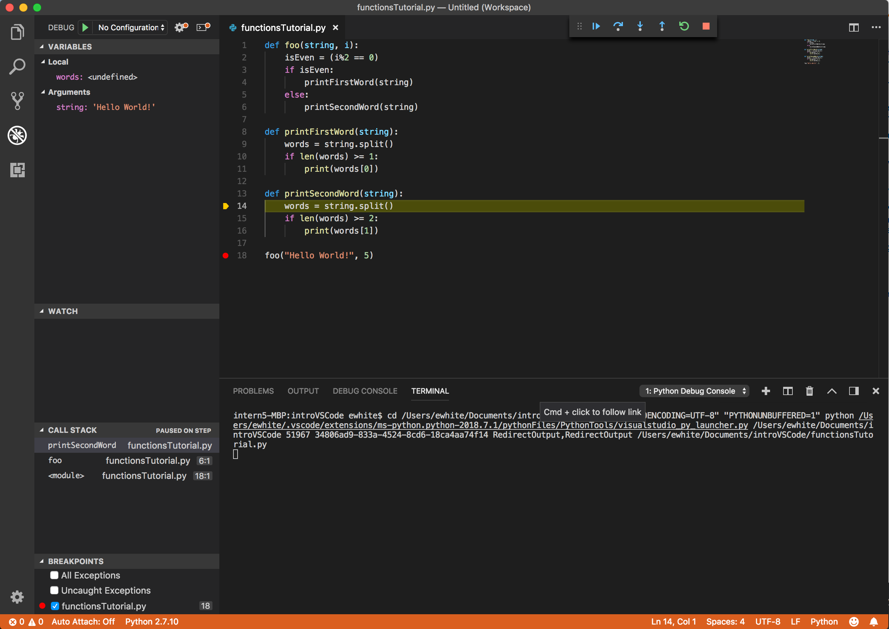
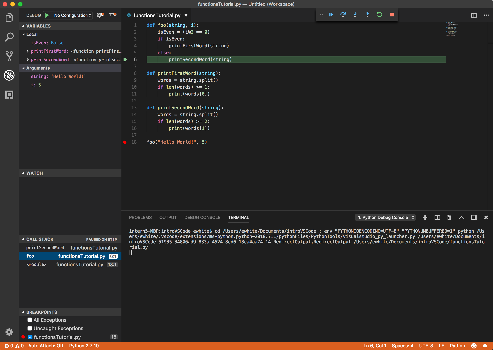

# Setup

This tutorial will teach you some basics about what capabilities Visual Studio Code gives you for debugging functions. 


Start by creating a new file, and copy-pasting the following code into it:
```
def foo(string, numIters):
    for i in range(numIters):
        if i % 2 == 0: # if i is even
            printFirstWord(string)
        else:
            printSecondWord(string)

def printFirstWord(string):
    words = string.split()
    if len(words) >= 1:
        print(words[0])

def printSecondWord(string):
    words = string.split()
    if len(words) >= 2:
        print(words[1])

foo("Hello World!", 5)
```

# VSCode Functionality


Then add a breakpoint on the call to `foo` (line 18), and run the program. 


After that, press the step into button (blue arrow pointing downwards), which will bring you into the `foo` function. 

The first thing we want to look at here is in the Variables pane under "Local." You should see three variables: `isEven`, `printFirstWord`, and `printSecondWord`. Of these three, `isEven` is pretty standard--it is just a local variable. The next two are not strictly local variables; `printFirstWord` and `printSecondWord` are here because they are functions that are called inside `foo`, so Visual Studio Code will also show them in the "Local" section. You probably will not need to pay a lot of attention to these beyond knowing that their existence in this pane means they are referenced in your current function.


You can also use VSCode to help navigate your code. If you look at one of the functions you are calling, say `printFirstWord` which you call on line 4, you can right click on the line where it calls it and select "Go To Definition," and VSCode will bring your cursor to the beginning of that function.



The next thing we want to look at is the "Arguments" section (click on the white triangle next to "Arguments" to expand the section). This section lets you see all of the arguments passed into your current function. Right now we can see that we have passed in "Hello World!" and 5 as the two parameters. 



Next, try stepping until we get to the function call for `printSecondWord` and step in. You can open the "Arguments" section, and you will now see what values were passed into `printSecondWord`.



However, if you want to see what values were passed in to `foo`, you can click on the entry in the call stack for `foo`, and it will switch to showing the arguments (and other local variables) for `foo`.



So this is how to look at how Visual Studio Code can help you navigate functions!
