What is a debugger? feat. VSCode


## Setting up the debugger

The first thing you want to do is download VSCode. You can download it from this website: https://code.visualstudio.com . 

Next, open it! It should look like this:

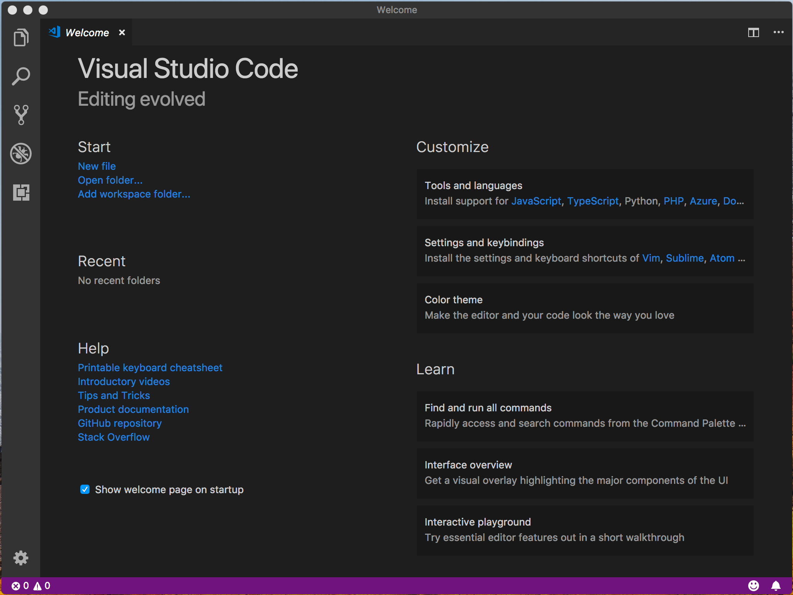
 

You want to hit the "Add workspace folder" under “Start.” This will prompt you to choose or create a new folder. You should make a new folder called "introVSCode." You should see an "Explorer" pane open on the left which has your folder under "UNTITLED(WORKSPACE)." 

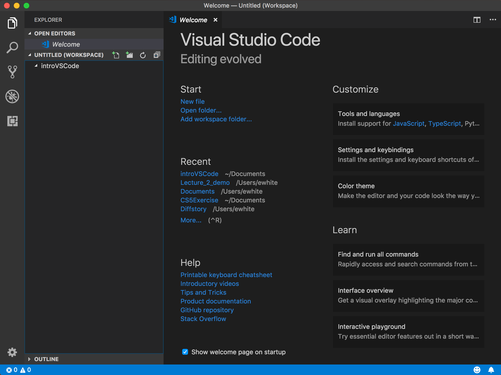


Next, hit the "New file" link. This will open a new file in the window. You should copy paste the following code into it:

```
def helloWorld():
    for i in range(5):
        if i < 4:
            print i
        else:
            print "Hello World!"
    
    print "Done!"


helloWorld()
```

Save this file as “whatIsADebugger.py” in the folder you just created. If you do not have the Python extensions installed, it will pop up a window on the bottom asking if you want to install it. You should click install.

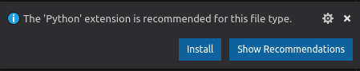
  

Then it will pop up a window on the left asking if you want to reload. You should click reload.

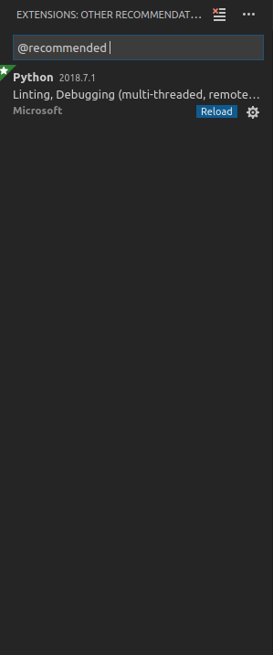
 

Once you are done with this step, the code on your screen should now be colorized.


Now, you want to launch the debugger by pressing the button on the left that looks like a bug. 

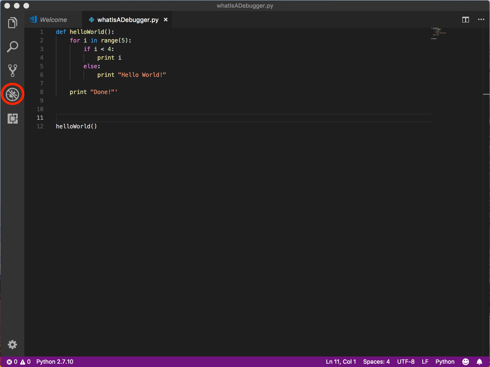


This should make the view look like this:

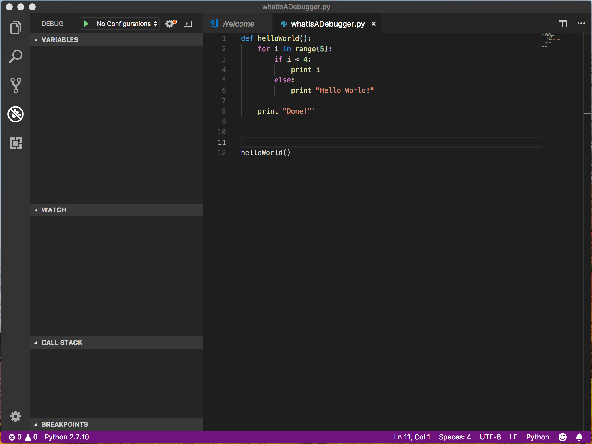
 

Click on the green arrow at the top next to the words “No Configurations”, it should pop up a menu that looks like this:

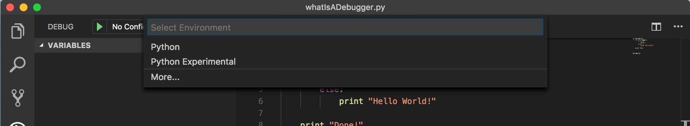
 

You should choose the “Python” option. This will run your program! You should see the output on the terminal at the bottom. 

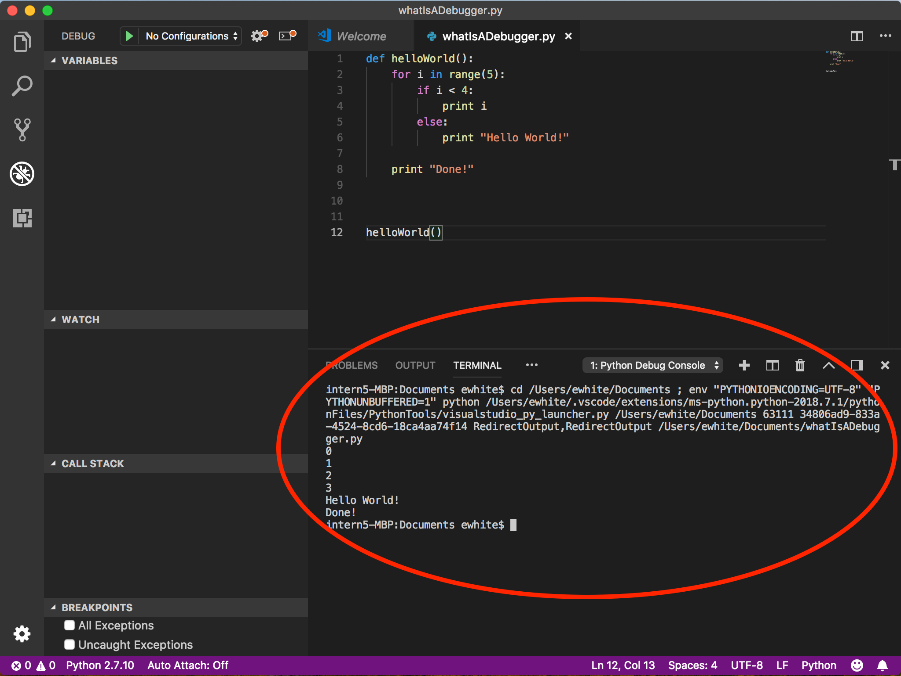

Now you know how to run your code in the debugger! Let’s figure out how to do something with it!


## Using the debugger

One of the most useful things that a debugger can do is allow you to stop your code at specific places or step through it line by line.

In order to get be able to do this with your program, mouse over the space to the left of the line numbers, and click on the red dot beside the line where you call `helloWorld()`. It should look like this when you are done.
 
 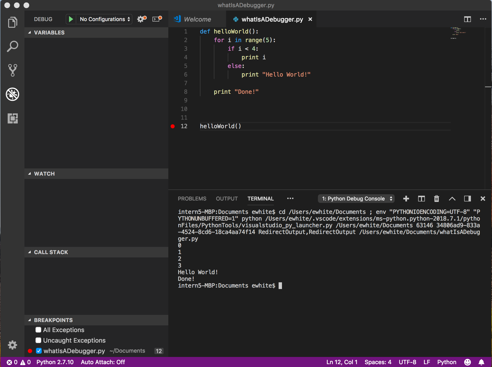


Then click the green arrow to run it again. It should stop on the `helloWorld()` line, and will denote this by highlighting the line in yellow. Your window should look like this:

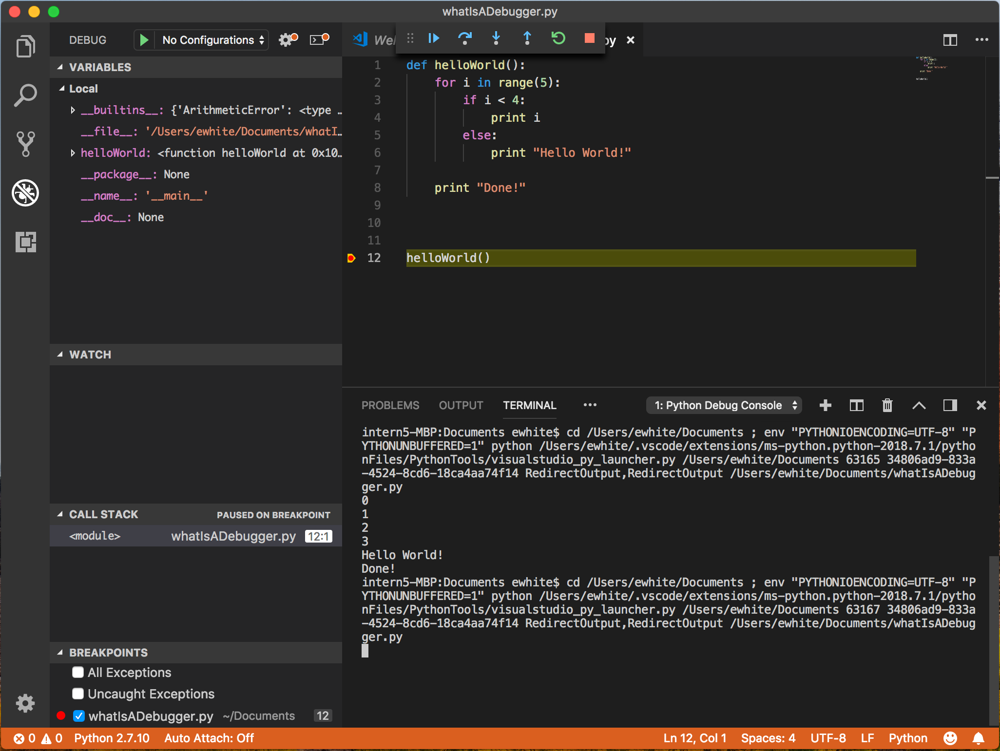
 

Right now, the program is stopped right before it executes this line, so it has not completed the call to `helloWorld()` yet. 

Now we want to look a little more closely at the menu at the top.

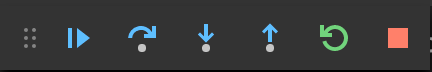

The gray dots on the left let you move the menu from left to right, so you can position this menu wherever is easiest for you. This is a summary of the other buttons from left to right:
1.	Continue (Blue triangle): This button tells the program to start running again when you are currently stopped somewhere. If you were to press this now, it would run your program to completion (but don’t do it yet!).
2.	Step over (Blue curved arrow): This runs the line of code you are currently stopped at (the one that is highlighted). It will stop at the next line of code. If the line of code you are currently stopped at includes a function call, it will complete that function call without stopping. So if you pressed it right now it would finish the program, because the current line is the last line in the program.
3.	Step into (Blue down arrow): This goes into whatever function is called by the current line (if there are multiple function calls in one line, it goes into them in the order they are executed). So if you pressed this one right now, it would bring you to the first line of `helloWorld()`.
4.	Step out (Blue up arrow): This finishes whatever function you are currently in, and brings you back up to the line that called it. So if you were inside of `helloWorld()` and pressed this button, you would finish `helloWorld()` and stop back at the line that you are stopped at now.
5.	Restart (Green circular arrow): This restarts your program from the beginning.
6.	Stop (Red square): This stops your current program. Once you press this button, your program is no longer running in the debugger.

Now try navigating around your program a bit! See if you can guess what will happen when you press each button before you press it, and feel free to add code to see what happens.

When you feel comfortable with these buttons, we will go on to see what information we can get from VSCode.


## Getting Information

So now you know how to jump around your code, but you might be wondering how that would help you debug something. Here we will talk about what VSCode can tell you about what’s going on in your program.

### Variables pane

Look at the panes on the left side of the screen. The first and probably most useful pane is the “variables” pane.  This will give you a list of all of the variables that are currently in your function and their value at the current point in time. When you are not in any functions, it will show a bunch of weird variables that Python has at the global scope, but you can ignore those. 

Try stepping into `helloWorld()`, and seeing what the variables look like!

You should initially see this:

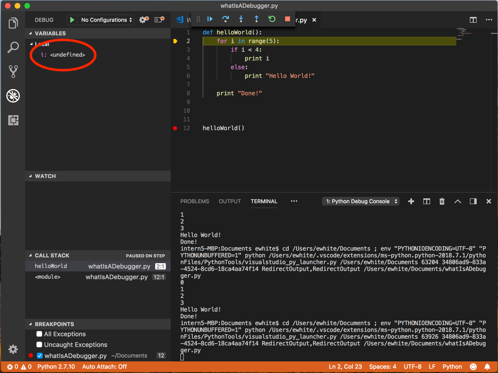
 

Right now, `i` is `undefined` because we have not yet passed the line of code where `i` gets declared. Once we step to the next line of code, we can see `i`’s value.  

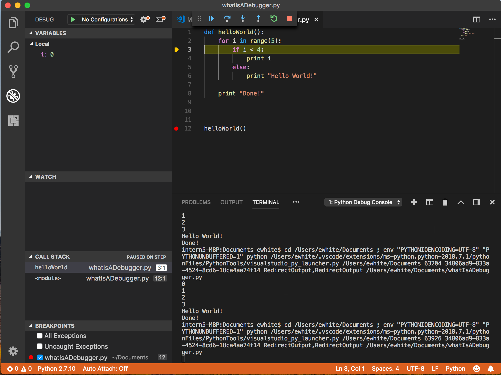

Now `i` is 0, because this is the first iteration of the for loop. You can try stepping through and seeing `i` change as the loop continues on.

The variables pane allows you to track what is happening to the data in your program as the program executes. This is helpful if you are trying to figure out a bug in your program, and you notice one of the variables is not what you think it should be. 

### Watch pane

This pane allows you to keep track of specific variables even when they are outside of the scope. You can see this in action by adding this line to the top of your file:
```
wordOfTheDay = "Hi"
```

Now try going into the middle of `helloWorld()`. It should show only the variable `i`. 

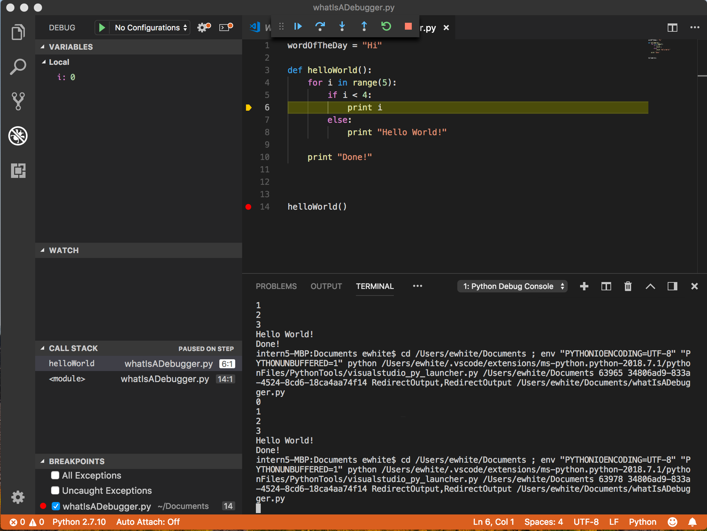

But maybe we want to see the value of `wordOfTheDay`. Try clicking inside the Watch pane. It should make some symbols appear in the top right. You should click on the “+”.

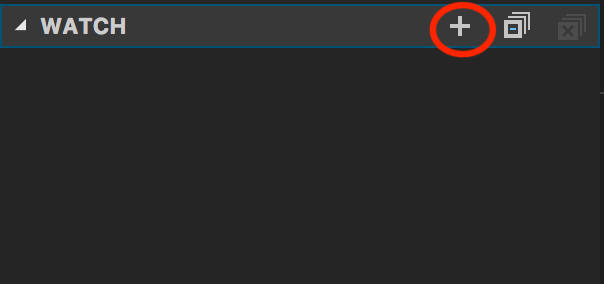
 

This will bring up a line for you to type in. Type “wordOfTheDay” and press enter. 

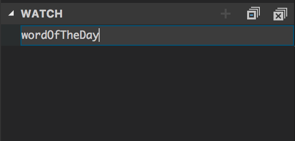

This will show you the current value of `wordOfTheDay`.

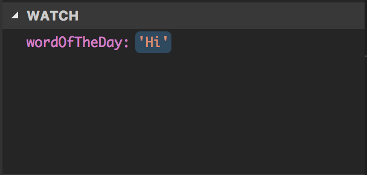

You can also use the Watch pane to evaluate any random expression. For example, say you want to know the value of `i+5`. You can type this in, and it will evaluate it for you.

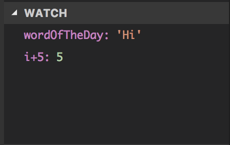

This can be convenient for things like finding the type of a variable or checking if something is True. See if you can figure out how to get the type of `i` using the watch pane! (Hint: there is a `type()` function in Python that takes an argument and returns its type.)
 


### Call Stack Pane

This pane shows you the current call stack.

If you don’t know what a call stack is, it is a list of all of the functions that called your current function. So if you had a function `a()` which called a function `b()` and you were stopped in the function `b()`, the call stack would show `b()` followed by `a()` follow by `<module>`. `<module>` denotes the stuff that is outside a function. 

Try going into the middle of `helloWorld()` and looking at the call stack. It should look like this:
 
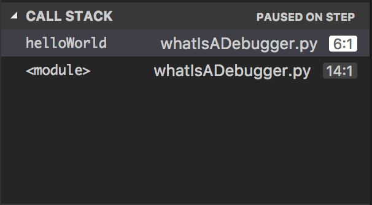
 

The first line says helloWorld, because that is the function we are currently in. To the right, it then specifies the file we are in, which is “whatIsADebugger.py”, and what line number we are on, which is 6. The next line says module, which means that helloWorld was called from outside of any function. This gives us the line number, which is 14, so we can see that this is referring to the call we make to `helloWorld()`. 

We can see when the call stack is a little more useful by adding this code:
```
def reverseString(s):
    if (len(s) <= 1):
        return s # the reverse of a single character is just the character
    return reverseString(s[1:]) + s[0]

reverseString("abcde")
```

Then try setting a breakpoint on the first line of reverse string and running.

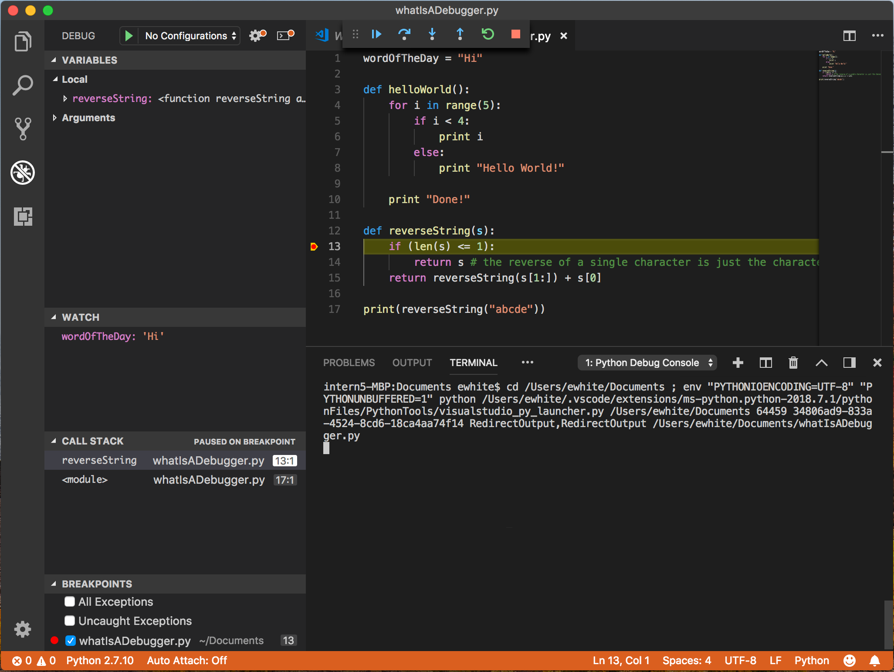
 

You can see the call stack in the call stack pane. It shows that you are in `reverseString(s)`, which was called directly from outside of any functions. Try stepping down to the return statement and stepping into the next call to `reverseString(s)` (this should involve pressing the step over button once, followed by the step in button once). Then, on the call stack, you should be able to see both the original call to `reverseString(s)`, followed by this new nested call.  

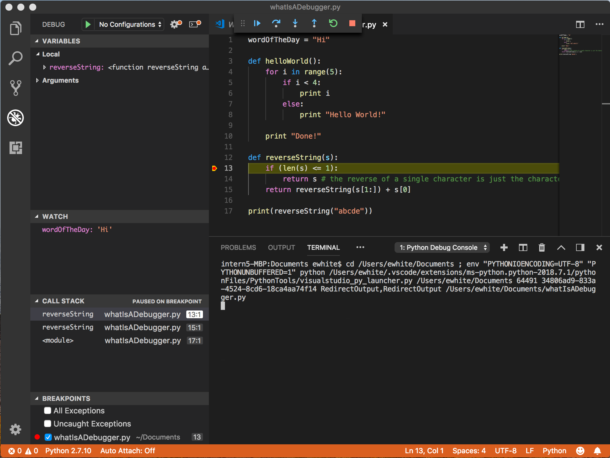

This call stack actually gives you more power than just being able to see what functions were called. Try expanding the Arguments menu in the variables pane; this will show you what `s` is when `reverseString(s)` was called. 

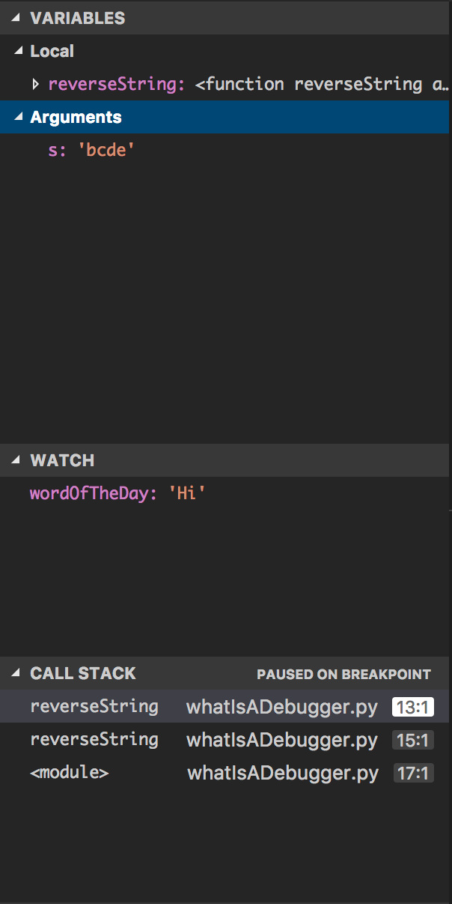

However, if you click on the other `reverseString(s)` on the call stack, which should be the original call to `reverseString(s)`, it will change the arguments (as well as local variables, although we do not have any in the function) to those for this instance of `reverseString(s)`. This can be really helpful when you are doing recursive functions, because you can go through all the different times the function was called to see what arguments it was being called with.


### Breakpoints Pane

This is the bottom pane. It shows a list of all of the breakpoints you currently have set. You can use the checkboxes to disable a breakpoint without deleting it. 

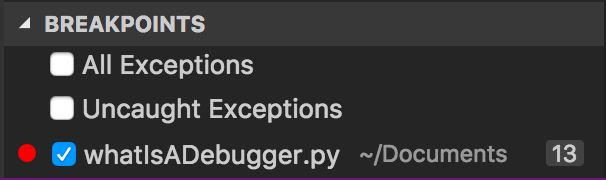

You might also notice the lines saying “All Exceptions” and “Uncaught Exceptions”. Checking these boxes means that if the program would normally throw an exception, it will instead stop on that line of code. This means that you do not exit the program when an exception is thrown, so you can still look at all of the information in the various other panes.

This is the end of the What is a Debugger tutorial! I hope you have a better understanding of what a debugger is and how to use it!
