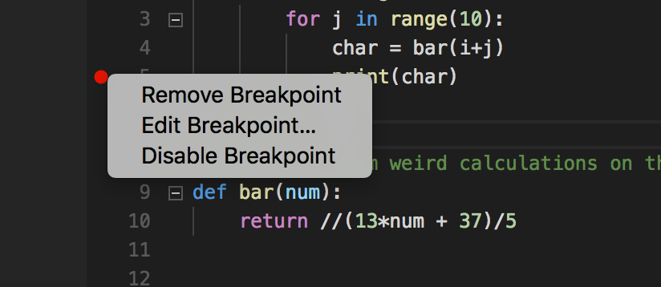
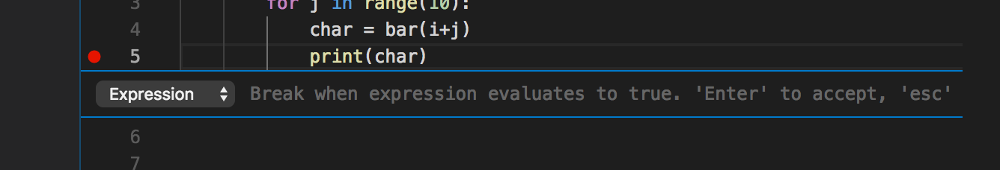
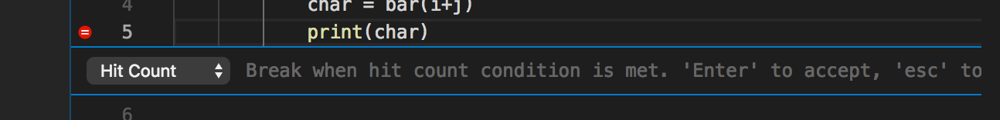

## Intro exercise: Scripted breakpoints.


Visual studio code lets you set breakpoints, but sometimes you want them to only happen some of the time. Scripted breakpoints let you do this! There are two ways to do scripted breakpoints in VSCode: either using an expression or by hit count (there is also an option to have breakpoints log a message, but we will not be talking about those).

In order to try this out, copy the following code into your editor:
```
def foo():
    for i in range(10):
        for j in range(10):
            char = bar(i+j)
            print(char)

# do some random weird calculations on the number
def bar(num):
    return (13*num + 37)/5


foo()
```

If you try running it, you will see that it outputs a bunch of random numbers. However, we specifically want to see what number it is outputting when `i` is 7 and `j` is 9 (without calculating it based on the `bar()`--we computer scientists are too lazy to actually do math). 

The simplest way to do this is to set a breakpoint on the print line, and keep pressing continue until `i` is 7 and `j` is 9; however, that sounds really annoying, so let’s do it an easier way!

Create a breakpoint on the printline, and then right-click on it. This should pop up a menu. You want the “Edit Breakpoint” option. 


Then this will bring up a line that has a menu and a space for you to type. You want the menu to say “Expression.” 


This now means that the breakpoint will only stop code if the expression you type here evaluates to true. So if you wrote `i == 5`, it would only stop the code when `i` was 5. Type an expression here so that the code stops when `i` is 7 and `j` is 9. What value is `char`?


So now you have the value of `char`! Now we’re going to find it again, but with a different method. Edit the breakpoint again, and this time change it to a “Hit Count” breakpoint.

 



This breakpoint will only work when it has already been passed a certain number of times. Try putting in a number that you think will make the breakpoint stop it when `i` is 7 and `j` is 9. When it is stopped, check that `i` and `j` are correct in the variables pane. Does it give you the same value for `char`? (It should).
